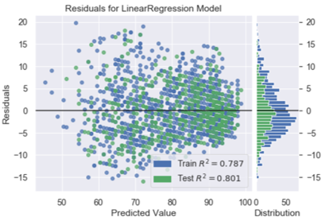

# Weather-and-Temperature-Predictions

***Disclaimer:*** *All the information in this repository, README including the Machine Learning Algorithm are provided and published for educational purpose only.*

### **Introduction/Description of project**

Weather can make a huge impact in our lives. It is not only important to us, but it is also an essential to our daily survival.
In this project I am going to present how weather in Houston, Texas, specifically of rainfall and temperature, can be predicted in advance using historical daily weather (i.e.  precipitation, rain, and temperature) data from the National Oceanic and Atmospheric Administration (NOAA)

### **Goal**
*	Weather prediction such as rainfall is one of the major concerns in the field of meteorology. Several techniques I believed that they will help to predict the weather are based on Machine Learning and Deep Learning methods.
* My goal is to use various Machine Learning and Deep Learning methods to assist with rainfall and temperature predictions.

#### **Machine Learning methods used:**
* ***SVM with Support Vector Classifier (SVC)*** – It is a widely used for classification and regression problems. 

* ***Logistic Regression*** – It is a popular classification algorithm used for binary classification problems. Logistic Regression is an improved version of Linear Regression

* ***Random Forest*** – It is considered a classification algorithm that consisting of many decision trees.

*	***Linear Regression*** – It is a statistical process to determine an estimated relationship of two variable sets. In our project we used it to forecast/predict the relationship between 2 variables (Max and Min Temperatures)

#### **Deep Learning method used:**

* ***Long-Short Term Memory (LSTM)*** – It is a type of Recurrent Neural Network (RNN) architecture used in the field of deep learning. LSTM is a great choice for Time Series forecasting/predicting (such as temperature).
  - Time Series is a collection of data points indexed based on the time they were collected.

### **Dataset**
* The historical Houston public daily weather data are downloaded from the [NOAA website](https://nomads.ncep.noaa.gov/)

### **Major used Libraries/Packages:**
* Panda (for file handling)
*	Numpy (for scientific computing)
*	Matplotlib (for visualization plotting)
*	Scikit-Learn (for Machine Learning)
*	Keras (for Deep Learning)
*	TensorFlow (for Deep Learning)

### **Data Visualization for EDA**
* Missing data visualizations with [missingno](https://libraries.io/pypi/missingno)
    - The white horizontal lines in each column represent the null values.
      

* Visualizing the daily temperatures - maximum, average, and minimum
      

* Precipitation summary
    - The highest one day precipitation (rainfall): 16.07 inches - August 27, 2017
      

* 3D plot visualization of the weather condition
    - Blue dots = It rained when the precipitation (in Inches) increased
    - Red dots = It didn't rain when the precipitation (in Inches) at low level
      

## *********************************************
## **Rainfall Predictions**

### **Support Vector Classification (SVC)**
   -  No Rain = 337 days
   -  Rain = 96 days
   
  
### **Logistic Regression**
   -  No Rain = 338 days
   -  Rain = 87 days
  
      
### **Random Forest**
   -  No Rain = 337 days
   -  Rain = 158 days
  

  ### **Evaluating with ROC Curve on 3 models**
  
  
  ## *********************************************
## **Temperature Predictions**

### **Linear Regression**
   -  Visualizing the prediction
   
  
   -  Residual plot analysis on Train and Test data
    
  
  
  
  
  
  
  
  
